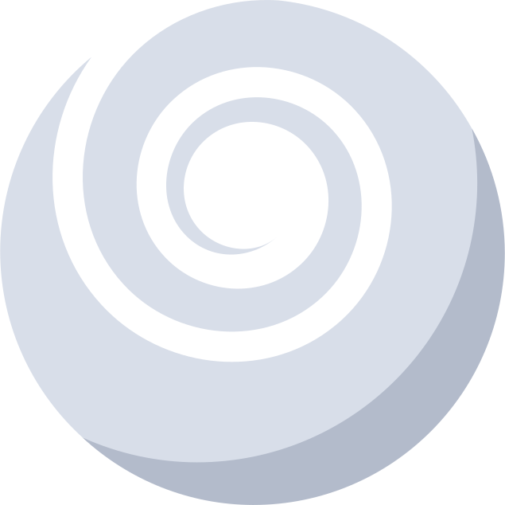

Recent Master's graduate from [Aarhus University](https://international.au.dk/) currently interested in:\
• Embedded and FPGA-accelerated machine learning.\
• Nanogrids and sustainable energy.\
• Everything Linux - check out [NovaOS](https://github.com/NicklasVraa/NovaOS/tree/main) .

I open-source my hobby projects and academic tools under the GPL license. \
Project stars and [linkedin](https://www.linkedin.com/in/nicklas-vraa-679586182/) skill endorsements are greatly appreciated.

 
\

Sponsor

  

\

Donations:
<a href="https://github.com/stephan-lechner">Stephan</a>

